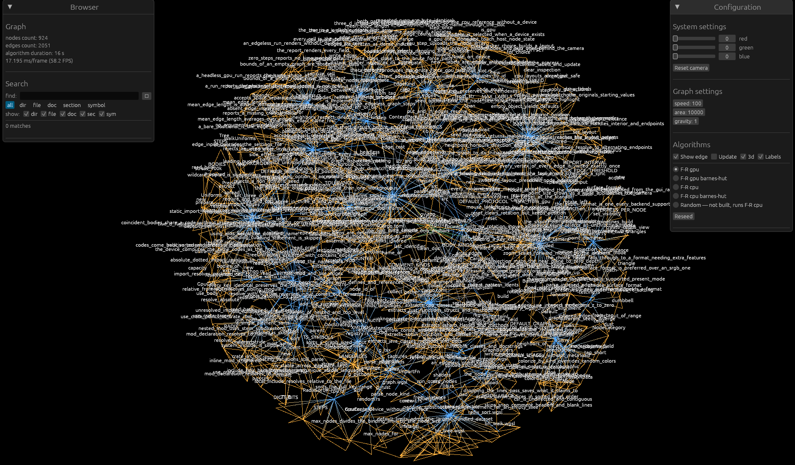

# repograph

Turn a code repository into a **typed knowledge graph** — then query it (to give an AI
compact, token-cheap context) or **browse it in an interactive 3D viewer** (search files
and symbols, colour by kind, walk the import/reference web).



Two things live here:

- **The knowledge graph** — a scanner (`rkg`) that walks a repo and builds a directed,
  typed graph of directories, files, docs, doc-sections and code symbols
  (functions, structs, classes, …), with `contains` / `imports` / `links` / `defines` /
  `references` edges. It answers questions like *"what does this file import?"*,
  *"who references this symbol?"*, and *"give me a budgeted neighbourhood around this
  seed"* — as text, JSON, or over **MCP** so Claude Code can call it live.
- **The viewer** — a GPU force-directed 3D graph browser (a fork of
  [graphvisualizer-rs](#credits)) extended to render the graph *with its real metadata*:
  nodes coloured by kind, a search panel, per-kind visibility filters, node labels, and
  click-to-inspect / click-an-edge-to-walk-it.

The scanner and viewer talk through a small on-disk format (`repo.edges` +
`nodes.tsv`), so you can build once and both query and visualise the result.

## Install Rust

This project uses the Rust **2024 edition**, so you need a recent stable toolchain
(Rust ≥ 1.85). The easiest way is [rustup](https://rustup.rs):

```sh
# Linux / macOS
curl --proto '=https' --tlsv1.2 -sSf https://sh.rustup.rs | sh
# then restart your shell, or:
source "$HOME/.cargo/env"

rustup update stable      # make sure you're on a 2024-edition-capable toolchain
rustc --version           # expect 1.85 or newer
```

On Windows, download and run `rustup-init.exe` from <https://rustup.rs>.

The **viewer** additionally needs a working GPU driver — Vulkan, Metal, DX12, or
OpenGL. If it fails to pick one, force a backend, e.g. `WGPU_BACKEND=gl` (fish:
`set -x WGPU_BACKEND gl`). The **scanner** and **MCP server** need no GPU.

## Build

```sh
git clone <this-repo> repograph && cd repograph
cargo build --release        # builds every crate: rkg, rkg-mcp, graphvisualizer
```

Binaries land in `target/release/`: `rkg` (scanner/query), `rkg-mcp` (MCP server),
`graphvisualizer` (viewer). A bare `cargo build`/`cargo test` covers the whole workspace.

## Full example

First build the workspace once — this compiles the GPU viewer and the tree-sitter
grammars, so the initial build takes a few minutes. Binaries land in
**`target/release/`** (use `target/debug/` if you build without `--release`):

```sh
cd repograph
cargo build --release
```

**One-liner** — scan a repo, export, and open the 3D browser in one go (replace
`<path_to_repo>` with the repository you want to explore). Keep the build out of this
chain so it doesn't rebuild every run:

```sh
target/release/rkg build <path_to_repo> -o /tmp/gv.json && target/release/rkg export --graph /tmp/gv.json --edges /tmp/gv.edges --nodes /tmp/gv.nodes.tsv && target/release/graphvisualizer -e /tmp/gv.edges -n /tmp/gv.nodes.tsv
```

Broken into steps (point step 1 at any repo; `.` scans repograph itself):

```sh
# 1. Scan a repository into a knowledge graph (respects .gitignore).
target/release/rkg build . -o /tmp/gv.json

# 2. Ask it things (add --json for machine-readable output with signatures/docs).
target/release/rkg query --graph /tmp/gv.json find loader --kind sym
target/release/rkg query --graph /tmp/gv.json context sym:crates/rkg-core/src/loader.rs::parse

# 3. Project it and open the searchable 3D browser.
target/release/rkg export --graph /tmp/gv.json --edges /tmp/gv.edges --nodes /tmp/gv.nodes.tsv
target/release/graphvisualizer -e /tmp/gv.edges -n /tmp/gv.nodes.tsv
```

To call the binaries by bare name (`rkg`, `graphvisualizer`, `rkg-mcp`) from anywhere,
install them onto your PATH once: `cargo install --path crates/rkg-cli`
(and `crates/rkg-mcp`, `crates/gv-app`). The rest of this README uses the bare names.

During development you can also run through cargo without building first, e.g.
`cargo run --release -p rkg-cli -- build .` or
`cargo run --release -p gv-app -- -e /tmp/gv.edges -n /tmp/gv.nodes.tsv`.

## `rkg` — the scanner & query CLI

```sh
rkg build [PATH] [-o .rkg/graph.json]     # scan a repo (respects .gitignore) → graph JSON
rkg query <SUBCOMMAND> [--graph P] [--json]
rkg export --edges repo.edges --nodes nodes.tsv [--graph P] [--edge-kind K ...]
```

Query subcommands:

| Command | What it does |
| --- | --- |
| `find <query> [--kind dir\|file\|doc\|sec\|sym]` | Substring search over name/path/id. |
| `neighbors <id> [--depth N] [--direction out\|in\|both] [--edge-kind K ...]` | Bounded traversal. |
| `context <seed> [--budget N]` | A ranked, **token-budgeted** neighbourhood — the compact bundle to read instead of whole files. Prefers semantic edges (imports/references) over directory containment. |
| `subgraph <id ...>` | The induced subgraph over a set of ids. |
| `path <a> <b>` | Shortest (undirected) path between two nodes. |

Node ids are stable and kind-prefixed: `dir:src`, `file:src/loader.rs`,
`doc:README.md`, `sec:README.md#format`, `sym:src/loader.rs::parse`. Add `--json`
to any query for machine-readable output (signatures, spans, doc comments, container
scope, and edge kinds all included).

**Code intelligence:** files are walked with a `.gitignore`-aware scanner. **Symbols**
(functions, structs, enums, traits, classes, interfaces, methods, …) are extracted with
tree-sitter and carry a **full signature** (parameters + return type), the **doc comment**,
their **container** (`impl Csr`, a class, a namespace, a module), the **variable names in
scope** (parameters + local declarations), and a line span.
**Imports/includes** become cross-file edges, resolved per language:

| Language | Symbols | Import edges |
| --- | --- | --- |
| Rust | ✓ | `mod` / `use crate::` |
| JavaScript / TypeScript | ✓ | `import` / `export … from` / `require` |
| Python | ✓ | `import a.b`, `from .mod import x` (incl. `__init__.py`) |
| C / C++ | ✓ | `#include "…"` (`.h` parsed as C++) |
| Java | ✓ | `import a.b.C;` → `a/b/C.java` |
| Kotlin | ✓ | `import a.b.C` → `a/b/C.kt` |
| C# | ✓ | `using A.B.C;` → `A/B/C.cs` (best-effort) |

Markdown headings become sections and `[links](…)` become edges. Adding a language is a
single entry in `crates/rkg-ingest/src/registry.rs` (grammar + node kinds + optional
import extractor).

## The viewer

```sh
graphvisualizer -e repo.edges -n nodes.tsv
```

Without the `-n nodes.tsv` sidecar it behaves like the original anonymous
edge-list visualiser (random colours, no search). With it, nodes are coloured by
kind and the browsing tools light up.

**Controls**

- **Move:** `W`/`S` forward/back, `A`/`D` strafe, `R`/`F` up/down.
- **Look:** arrow keys, or hold the **right mouse button** and drag.
- **Zoom:** mouse wheel. **Reset view:** `Space`. **Quit:** `Esc`.
- **Left-click a node** → open its inspector (kind, path, container, signature, doc).
- **Left-click an edge** → jump to one endpoint; click the same edge again to hop to
  the other end.

**Panels** (left = browsing, right = configuration):

- **Search** — find nodes by name/path, filter results by kind, and click a result to
  fly to it. The **show:** checkboxes hide whole kinds (their nodes, edges *and* labels).
- **Labels** — draw each node's name above it. Hidden while a layout is running; the
  positions snap on when you stop it (or when you tick Labels mid-run).
- **Algorithms** — pick a layout (`F-R gpu`, `gpu barnes-hut`, `cpu`, …), toggle
  `Update` to run it, `Reseed` to restart, `3d`/`Show edge` display options.
- **System settings** — background colour, **move speed** (W/S/A/D/R/F) and
  **wheel zoom** speed, and `Reset camera`. Speeds persist in `settings.json`.

## MCP server — query the graph from Claude Code

`rkg-mcp` exposes the graph as MCP tools over stdio, so an agent can pull targeted
context instead of reading files: `build` (scan a repo into the graph and make it
live), `find_node`, `neighbors`, `context_pack`, `subgraph`, and `path_between`.

The server can start before the graph exists — if the `--graph` file is missing it
begins empty and the agent calls `build` to populate it (and persist the JSON), so
no separate `rkg build` step is required.

```jsonc
// .mcp.json
{
  "mcpServers": {
    "repograph": {
      "command": "/absolute/path/to/target/release/rkg-mcp",
      "args": ["--graph", ".rkg/graph.json"]
    }
  }
}
```

The graph path can also come from the `RKG_GRAPH` environment variable.

## How it fits together

```
                 rkg build                 rkg export
   repository  ─────────────▶  graph.json ────────────▶  repo.edges + nodes.tsv
                                   │                              │
                        rkg query / rkg-mcp                 graphvisualizer
                        (text · JSON · MCP)                 (searchable 3D viewer)
```

## Credits

The 3D viewer is a fork of **[graphvisualizer-rs](https://github.com/rengare/graphvisualizer)**
by [@rengare](https://github.com/rengare) — an interactive Fruchterman–Reingold graph
layout that runs on the GPU via `wgpu`/`winit`/`egui`. Its `gv-*` crates
(`gv-graph`, `gv-gpu`, `gv-layout`, `gv-layout-gpu`, `gv-render`, `gv-gui`, `gv-app`,
`gv-config`) provide the rendering and layout engine that this project extends with
knowledge-graph metadata, search, and inspection.

`graphvisualizer-rs` is itself a Rust rewrite of the original C++ /
OpenGL 4.3 / SDL2 / Dear ImGui **[graphvisualizer](https://github.com/rengare/graphvisualizer)**,
also by @rengare, which pioneered the compute-shader graph-layout approach this
viewer inherits.

The viewer's panels are built with [egui](https://github.com/emilk/egui), a Rust
immediate-mode GUI — and the immediate-mode approach itself, along with the original's
whole GUI, comes from **[Dear ImGui](https://github.com/ocornut/imgui)** by
[Omar Cornut](https://github.com/ocornut), a fantastic immediate-mode native GUI that
the C++ `graphvisualizer` used directly and whose windows `graphvisualizer-rs` ported
to egui.

The knowledge-graph crates (`rkg-core`, `rkg-ingest`, `rkg-cli`, `rkg-mcp`) are new to
this project. Symbol extraction uses [tree-sitter](https://tree-sitter.github.io/) with
the Rust, JavaScript/TypeScript, Python, C, C++, Java, Kotlin, and C# grammars.

## License

Licensed under either of

- Apache License, Version 2.0 ([LICENSE-APACHE](LICENSE-APACHE) or
  <http://www.apache.org/licenses/LICENSE-2.0>)
- MIT license ([LICENSE-MIT](LICENSE-MIT) or <http://opensource.org/licenses/MIT>)

at your option — the standard Rust-ecosystem dual license.

**License chain.** The forked `gv-*` viewer crates originate from
[graphvisualizer-rs](https://github.com/rengare/graphvisualizer) and the C++
`graphvisualizer`, both by the same author, and are released here under the same
`MIT OR Apache-2.0` terms as the rest of the project. Every third-party dependency is
used under its own **permissive** license — predominantly MIT and/or Apache-2.0, with
some BSD, Zlib, ISC, BSL-1.0, and Unicode-3.0; **none are copyleft**. tree-sitter and
its grammars are MIT; `egui`, `wgpu`, and `winit` are MIT or Apache-2.0. When you
redistribute a **compiled binary**, include those dependencies' license texts and
notices (generate them with e.g. [`cargo-about`](https://github.com/EmbarkStudios/cargo-about)
or [`cargo-bundle-licenses`](https://github.com/sstadick/cargo-bundle-licenses)).

Unless you explicitly state otherwise, any contribution intentionally submitted for
inclusion in this work by you, as defined in the Apache-2.0 license, shall be dual
licensed as above, without any additional terms or conditions.
